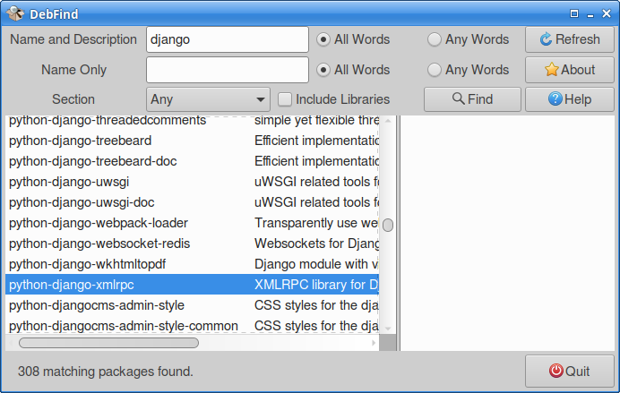

# DebFind

A GUI application for finding Debian packages on Debian and Debian-based
systesm (such as Ubuntu) written in D/GtkD.

**WARNING** This crashes when there are too many results and so has not
been completed. Hopefully a wxPython version will succeed this.

## Build

You will need a D compiler and the GtkD 3 library.

To get a D compiler (I use LDC) see: 
[dlang.org/download.html](https://dlang.org/download.html).

Once D is installed, install the Gtk runtime, then download and install
the GtkD library. For these, see:
[gtkd.org](https://gtkd.org/).

Make sure `dub` can find GtkD by running:

`dub add-path path/to/GtkD3`

Then, in the directory you've cloned or unpacked DebFind, if using LDC
run:

`dub -brelease`

(For other compilers either just run `dub` or lookup how to do a release
build.)

Then, move the DebFind executable to somewhere convenient.

## License

GPL-3.0.
